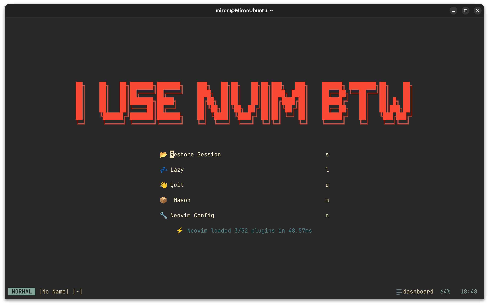
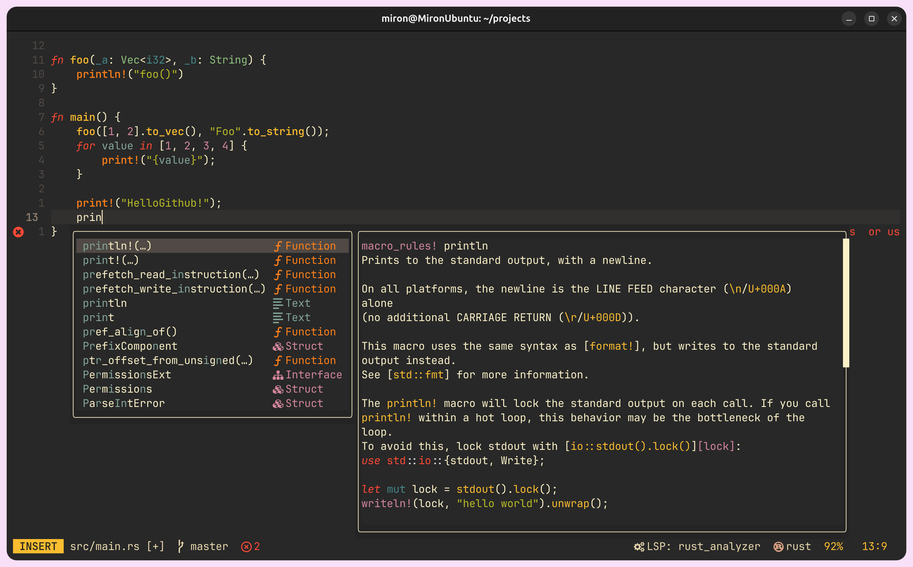
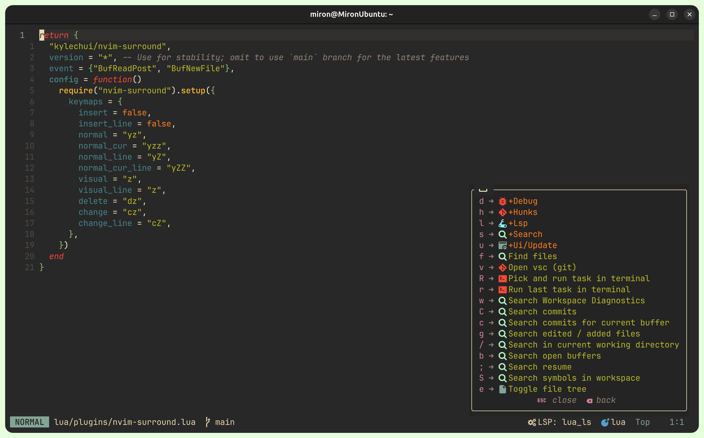

# My neovim configuration 🤗

#### To understand some of my settings, you may need to know that I use the following keymaps in the system


<table>
    <tr>
        <th>Select</th>
        <th>To</th>
        <th>Commentary</th>
    <tr>
    <tr>
        <td>CAPS</td>
        <td>ESC</td>
        <td>Game changer. Every vim user has to do this</td>
    <tr>
        <td>ALT</td>
        <td>CTRL</td>
        <td>
            Of course, I had to relearn CTRL + V, CTRL + C, CTRL + A, etc but it was worth it. But what about the alt?
            I did not change the left control to the alt. Instead, I use the right alt. It's more ergonomic because I don't have to leave homerow.
            So, I use the left alt as a control, and the right alt as the actual alt
        </td>
    </tr>
    <tr>
        <td>CTRL + M</td>
        <td>CAPS</td>
        <td>Here and below, I press alt physically on the keyboard instead of ctrl because of the above keymaps</td>
        <td></td>
    </tr>
    <tr> <td>CTRL + TAB</td>
        <td>ALT + TAB</td>
        <td>ALT + TAB was the only combination where I used ALT key lol</td>
    </tr>
    <tr>
        <td>CTRL + J</td>
        <td>↓</td>
        <td></td>
    </tr>
    <tr>
        <td>CTRL + K</td>
        <td>↑</td>
        <td></td>
    </tr>
    <tr>
        <td>CTRL + H</td>
        <td>←</td>
        <td></td>
    </tr>
    <tr>
        <td>CTRL + L</td>
        <td>→</td>
        <td></td>
    </tr>
    <tr>
        <td>CTRL + B</td>
        <td>CTRL + ←</td>
        <td></td>
    </tr>
    <tr>
        <td>CTRL + E</td>
        <td>CTRL + →</td>
        <td></td>
    </tr>
</table>


### Dashboard 😎
 

### Editor 😻 


### Keymaps 🚀


### Do you want to check it out?) ⭐
#### Linux
0. First of all you need to make sure that you have all external [dependencies](https://github.com/nvim-lua/kickstart.nvim) listed here
1. Clone repo
```shell
git clone https://github.com/miron2363/nvim.git ~/.config/nvim-m
```
2. Add in you bashrc line below [(wtf?)](https://michaeluloth.com/neovim-switch-configs/)
```shell
alias vm='NVIM_APPNAME=nvim-m nvim'
```
3. Launch using "vm"
```shell
vm
```
4. Open Mason and install the LSP servers you need. Do :checkhealth if something goes wrong
### Favourite keymaps ✨
1. ga (Goto prev buffer)
2. g; (Goto last change in buffer)

