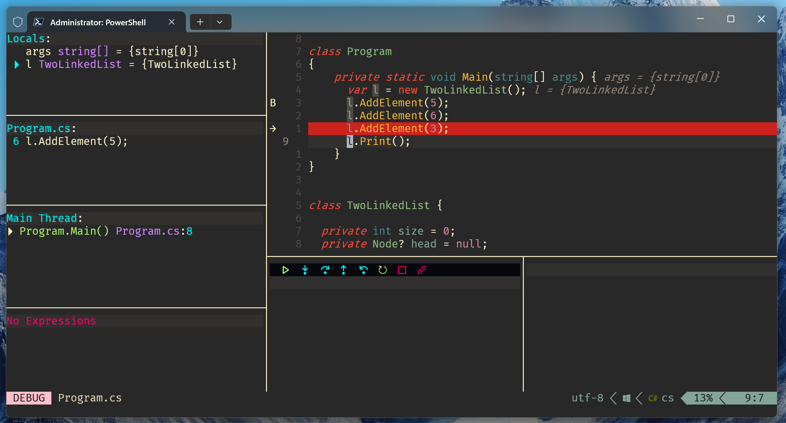
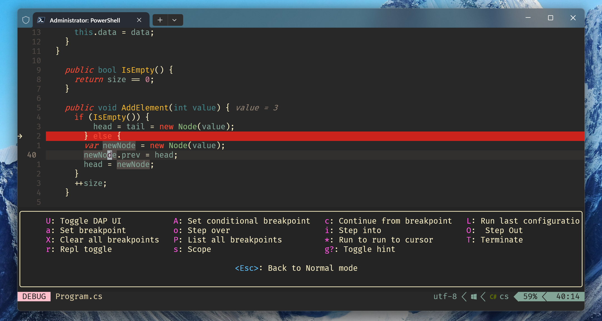
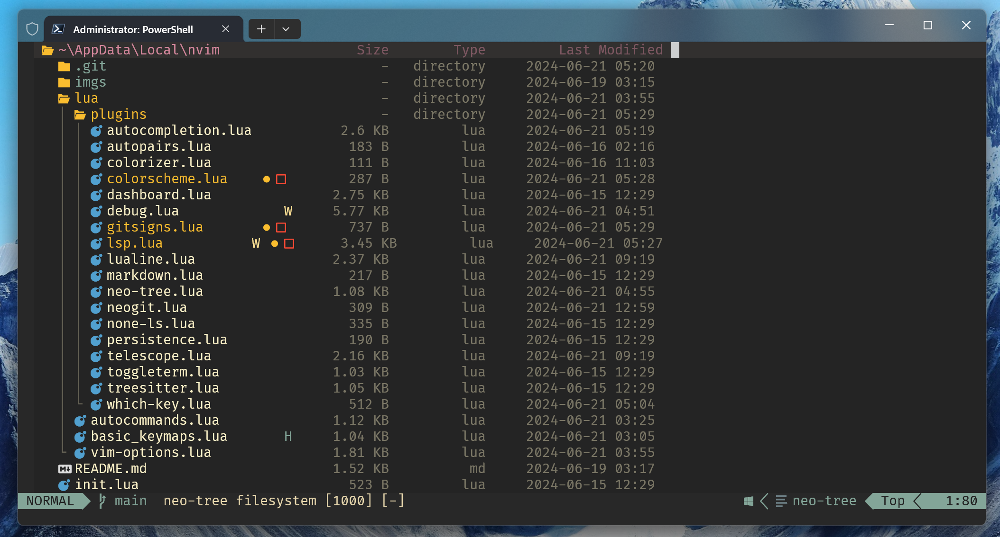
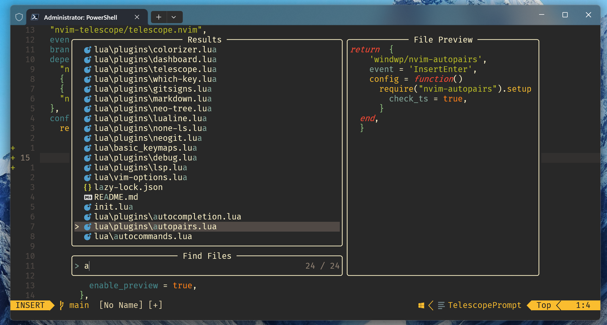

# My neovim configuration 🤗

#### To understand some of my settings, you may need to know that I use the following keymaps in the system

<table>
    <tr>
        <th>Select</th>
        <th>To</th>
        <th>Commentary</th>
    <tr>
    <tr>
        <td>CAPS</td>
        <td>ESC</td>
        <td></td>
    <tr>
        <td>CTRL</td>
        <td>ALT</td>
        <td> It is very easy to use CTRL + D/U/R and other combinations with CTRL in vim with without leaving home row </td>
    </tr>
    <tr>
        <td>ALT</td>
        <td>CTRL</td>
        <td> Of course, I had to retrain CTRL + V, CTRL + C, CTRL + A, but it was worth it </td>
    </tr>
    <tr>
        <td>CTRL + M</td>
        <td>ESC</td>
        <td>Here and below, I press alt instead of ctrl because of the keymap above</td>
        <td></td>
    </tr>
    <tr> <td>CTRL + TAB</td>
        <td>ALT + TAB</td>
        <td>ALT + TAB was the only combination where I used ALT key lol</td>
    </tr>
    <tr>
        <td>CTRL + J</td>
        <td>↓</td>
        <td></td>
    </tr>
    <tr>
        <td>CTRL + K</td>
        <td>↑</td>
        <td></td>
    </tr>
    <tr>
        <td>CTRL + H</td>
        <td></td>
        <td></td>
    </tr>
    <tr>
        <td>CTRL + L</td>
        <td>→</td>
        <td></td>
    </tr>
    <tr>
        <td>CTRL + B</td>
        <td>CTRL + ←</td>
        <td></td>
    </tr>
    <tr>
        <td>CTRL + E</td>
        <td>CTRL + ←</td>
        <td></td>
    </tr>
</table>

### Colorscheme 😻 

### Debug Mode using Hydra 🐍
 
 

### File Tree 🌳
 

### Toggle Term 👽
 

### Telescope 🔭
 
### Dashboard 😎
 

### Favourite keymaps ✨
1. \<C-h> and \<C-l> (Switch placeholders snippets)
2. g. (Goto prev buffer)
3. \<leader>d (Debug mode. See below)

#### TODO ⚒️ 
- [ ] Add a description and my opinion to each plugin above
